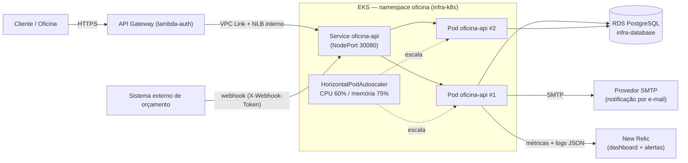

# oficina-api

Quarto dos quatro repositórios da Fase 3 do Tech Challenge FIAP PosTech
(SOAT). Sistema Integrado de Atendimento e Execução de Serviços para
oficina mecânica: cadastro de clientes/veículos/serviços/peças, abertura e
acompanhamento de Ordens de Serviço, aprovação de orçamento via webhook e
notificação por e-mail — em **Clean Architecture**, publicado como imagem
Docker e implantado no cluster **EKS** provisionado por `infra-k8s`.

## Propósito

Este repositório contém a aplicação de negócio propriamente dita: a API
REST que o cliente final acessa (via o API Gateway de `lambda-auth`) para
consultar o andamento da sua OS, e que a oficina usa para conduzir todo o
fluxo de atendimento — do cadastro do cliente à entrega do veículo. É o
único dos quatro repositórios que não é infraestrutura: sua pipeline não
roda Terraform nem conhece manifestos Kubernetes — apenas publica a imagem
no ECR e troca a tag no `Deployment` já existente, aplicado por
`infra-k8s`, via `kubectl set image`.

## Tecnologias

| Camada | Tecnologia |
|---|---|
| Linguagem | Java 21 |
| Framework | Spring Boot 3.4.5 |
| Arquitetura | Clean Architecture (Entities / Use Cases / Gateways / Presenters / Controllers) |
| Banco de dados | PostgreSQL 16 (RDS gerenciado por `infra-database`) |
| Migrations | Flyway |
| Segurança | Spring Security + JWT (JJWT 0.12) — JWT emitido por `lambda-auth` para o cliente final; login administrativo próprio para a equipe da oficina |
| Notificações | Spring Mail (SMTP/SendGrid) + webhook de entrada |
| Documentação | SpringDoc OpenAPI / Swagger UI |
| Observabilidade | Agente Java New Relic + Micrometer (métricas de negócio) + logs JSON com correlação |
| Testes | JUnit 5 + Mockito + Testcontainers + ArchUnit |
| Cobertura | JaCoCo (mínimo 80% nos domínios críticos) |
| Container | Docker (multi-stage, usuário não-root, healthcheck) |
| Orquestração | Kubernetes (EKS, via `infra-k8s`) + HPA |
| CI/CD | GitHub Actions (build, testes, imagem no ECR, rollout no EKS) |

## Arquitetura

### Clean Architecture (por Bounded Context)

```
br.com.oficina.<contexto>/
├── entities/        # Entidade de domínio + Value Objects — regra de negócio pura
├── usecases/        # Um Use Case por operação; fala com Gateways via interface
├── gateways/        # Ports (interfaces) — sem framework
├── presenters/      # Monta o Response/ViewModel a partir da saída do Use Case
├── controllers/     # Recebe DTO, chama Use Case, devolve via Presenter
└── infrastructure/  # Frameworks & Drivers: JPA (*Data), *GatewayImpl, config, mappers
```

A regra de dependência (sempre para dentro) é validada por um teste
**ArchUnit** (`br.com.oficina.architecture.ArchitectureTest`). Decisão
registrada em [`docs/adr/0001-clean-architecture.md`](https://github.com/olavowilke/soat-oficina-api/blob/main/docs/adr/0001-clean-architecture.md).

### Esta aplicação no caminho da requisição (AWS)



Este repositório é dono apenas da **imagem** (`Dockerfile`) e do **código**
da aplicação; a rede, o cluster e os manifestos base (`Deployment`,
`Service`, `HPA`, `PDB`) pertencem a `infra-k8s` — a pipeline deste
repositório não conhece nenhum manifesto/overlay kustomize (eles vivem em
outro repositório) e só troca a tag da imagem no `Deployment` já existente,
via `kubectl set image`. Ver [`docs/arquitetura/componentes.md`](https://github.com/olavowilke/soat-oficina-api/blob/main/docs/arquitetura/componentes.md)
para a visão completa dos 4 repositórios juntos.

## Passos de execução (local)

### Pré-requisitos

- Java 21+, Maven 3.9+ (ou o wrapper incluso, `./mvnw`)
- Docker e Docker Compose

### Rodando

```bash
docker compose up -d db          # só o banco
./mvnw -s settings.xml spring-boot:run
# ou, tudo via compose:
docker compose up --build
```

A API estará disponível em `http://localhost:8080/api`. Variáveis de
ambiente completas (banco, JWT, webhook, e-mail) e o passo a passo de
autenticação/admin padrão estão documentados inline em
[`src/main/resources/application.yml`](src/main/resources/application.yml).

### Testes

```bash
./mvnw -s settings.xml verify   # testes + JaCoCo (Testcontainers sobe o Postgres sozinho)
```

## Deploy

A aplicação **não roda Terraform própria** — ela é implantada no cluster já
existente, provisionado por `infra-k8s`:

```bash
# build + push (feito pela pipeline, via ECR — ver secrets abaixo)
docker build -t <ecr_repository_url>:sha-<git-sha> .
docker push <ecr_repository_url>:sha-<git-sha>

# troca so a imagem do Deployment que ja existe (criado por infra-k8s) —
# nenhum manifesto/overlay kustomize e lido ou aplicado por esta pipeline
aws eks update-kubeconfig --name <cluster_name> --region <aws_region>
kubectl -n oficina set image deployment/oficina-api "oficina-api=<ecr_repository_url>:sha-<git-sha>"
kubectl -n oficina rollout status deploy/oficina-api --timeout=300s
```

O deploy real é feito pelo workflow `cd.yml` (branch `homolog` → ambiente
`homolog`, branch `main` → ambiente `prod`): login no ECR via OIDC, build e
push da imagem, leitura da URL do ECR e do nome do cluster via SSM
(publicados por `infra-k8s`), `kubectl set image` no `Deployment` já
existente e um smoke test final contra `/api/actuator/health` através do
API Gateway. Esta pipeline **não roda kustomize nem conhece o caminho dos
manifestos** — depois do split, `infra-k8s/k8s/` nem existe dentro deste
repositório; `infra-k8s` é quem é dono do estado desejado dos manifestos
(réplicas, HPA, PDB etc.) e quem os aplica.

> **Nota de organização do monorepo:** enquanto os 4 repositórios convivem
> como diretórios deste monorepo (antes do split — ver
> [`scripts/split-repos.sh`](https://github.com/olavowilke/tech-challenge-1/blob/main/scripts/split-repos.sh)),
> esta pipeline roda a partir de `.github/workflows/` na **raiz** do
> monorepo (`working-directory`/`context` apontando para `oficina-api/`).
> `oficina-api/.github/workflows/` já existe dentro deste diretório, com o
> mesmo par `ci.yml`/`cd.yml` reescrito com caminhos relativos à raiz DESTE
> repositório — mas fica inerte enquanto o diretório vive dentro do
> monorepo (nenhum evento do GitHub Actions do monorepo aciona esses
> arquivos). Ele só passa a rodar de fato depois do split, quando
> `oficina-api/` vira a raiz do próprio repositório publicado.

## Documentação da API (Swagger / Postman)

Com a aplicação rodando:

- **Swagger UI:** `http://localhost:8080/api/swagger-ui.html`
- **OpenAPI JSON:** `http://localhost:8080/api/v3/api-docs`
- **Via API Gateway (produção/homolog):** `https://<api_endpoint>/api/swagger-ui.html`

A especificação OpenAPI é a fonte da coleção e pode ser importada direto no
Postman/Insomnia (*Import → Link*) a partir do OpenAPI JSON acima.

## Secrets e variables da pipeline

Este repositório **não define secrets próprios de infraestrutura** — sua
pipeline de deploy assume a mesma role usada por `infra-k8s` e lê os demais
dados (URL do ECR, nome do cluster) via SSM, publicados por aquele
repositório. Ainda assim, os workflows (`ci.yml`, `cd.yml`) exigem:

| Nome | Tipo | O que quebra se estiver ausente |
|---|---|---|
| `AWS_DEPLOY_ROLE_ARN` | Secret | O passo "Credenciais AWS (OIDC)" falha ao assumir a role — build/push da imagem e o rollout não acontecem |
| `AWS_REGION` | Variable | Opcional — sem ela, a pipeline usa `us-east-1` como padrão |
| `ANTHROPIC_API_KEY` | Secret | Só usado pelo workflow `claude-review.yml`; sem ele, a revisão automática de PR não roda (não afeta build/deploy) |

A role `AWS_DEPLOY_ROLE_ARN` precisa ter, além do já exigido por
`infra-k8s`, permissão de ECR (`ecr:GetAuthorizationToken`,
`ecr:BatchCheckLayerAvailability`, `ecr:PutImage`,
`ecr:InitiateLayerUpload`, `ecr:UploadLayerPart`,
`ecr:CompleteLayerUpload`) — ver [`infra-k8s/README.md`](https://github.com/olavowilke/soat-infra-k8s/blob/main/README.md#pipelines-githubworkflows).

## Justificativa do banco de dados

PostgreSQL foi escolhido por suporte nativo a UUID, maturidade
transacional (ACID), compatibilidade com Flyway/Hibernate e ampla adoção —
justificativa completa e o diagrama entidade-relacionamento estão em
[`infra-database/docs/modelo-dados.md`](https://github.com/olavowilke/soat-infra-database/blob/main/docs/modelo-dados.md)
(repositório dono do ciclo de vida do banco).

## Documentação complementar

A documentação de arquitetura compartilhada entre os 4 repositórios da
Fase 3 (`docs/`) tem **cópia canônica neste repositório** (o script de
split copia `docs/` para a raiz deste repositório junto com o conteúdo de
`oficina-api/`) — os outros três (`lambda-auth`, `infra-k8s`,
`infra-database`) linkam para cá em vez de duplicar. Por consistência com
os outros três READMEs, os links abaixo também usam a URL absoluta deste
repositório (funcionam a partir de qualquer um dos quatro):

| Documento | Conteúdo |
|---|---|
| [`docs/arquitetura/componentes.md`](https://github.com/olavowilke/soat-oficina-api/blob/main/docs/arquitetura/componentes.md) | Diagrama de componentes dos 4 repositórios na AWS |
| [`docs/arquitetura/sequencia.md`](https://github.com/olavowilke/soat-oficina-api/blob/main/docs/arquitetura/sequencia.md) | Diagramas de sequência (autenticação por CPF, abertura de OS) |
| [`docs/arquitetura/cicd.md`](https://github.com/olavowilke/soat-oficina-api/blob/main/docs/arquitetura/cicd.md) | Pipelines, ordem de apply e secrets/variables de todos os repositórios |
| [`docs/adr/`](https://github.com/olavowilke/soat-oficina-api/tree/main/docs/adr) | Decisões de arquitetura (Clean Architecture, API Gateway síncrono, HPA, 4 repositórios, contrato via SSM) |
| [`docs/rfc/`](https://github.com/olavowilke/soat-oficina-api/tree/main/docs/rfc) | RFCs (nuvem, API Gateway, autenticação, banco de dados) |
| [`design-docs/tech-challenge-2/PLANEJAMENTO-FASE-2.md`](https://github.com/olavowilke/tech-challenge-1/blob/main/design-docs/tech-challenge-2/PLANEJAMENTO-FASE-2.md) | Planejamento da Fase 2 (permanece no monorepo original, não faz parte do split) |
| [Board Miro — Documentação DDD](https://miro.com/app/board/uXjVOXA0ID4=/) | Event Storming, Context Map, Agregados e Linguagem Ubíqua |

> **Nota de organização do monorepo:** enquanto os 4 repositórios convivem
> como diretórios deste monorepo (antes do split — ver
> [`scripts/split-repos.sh`](https://github.com/olavowilke/tech-challenge-1/blob/main/scripts/split-repos.sh)),
> `docs/` vive na raiz do monorepo, um nível acima de `oficina-api/`. O
> script de split copia `docs/adr`, `docs/rfc` e `docs/arquitetura` para a
> raiz do repositório publicado — os workflows da aplicação **não**
> precisam dessa cópia: `oficina-api/.github/workflows/` já existe dentro
> deste diretório (ver nota equivalente na seção "CI/CD" acima).
