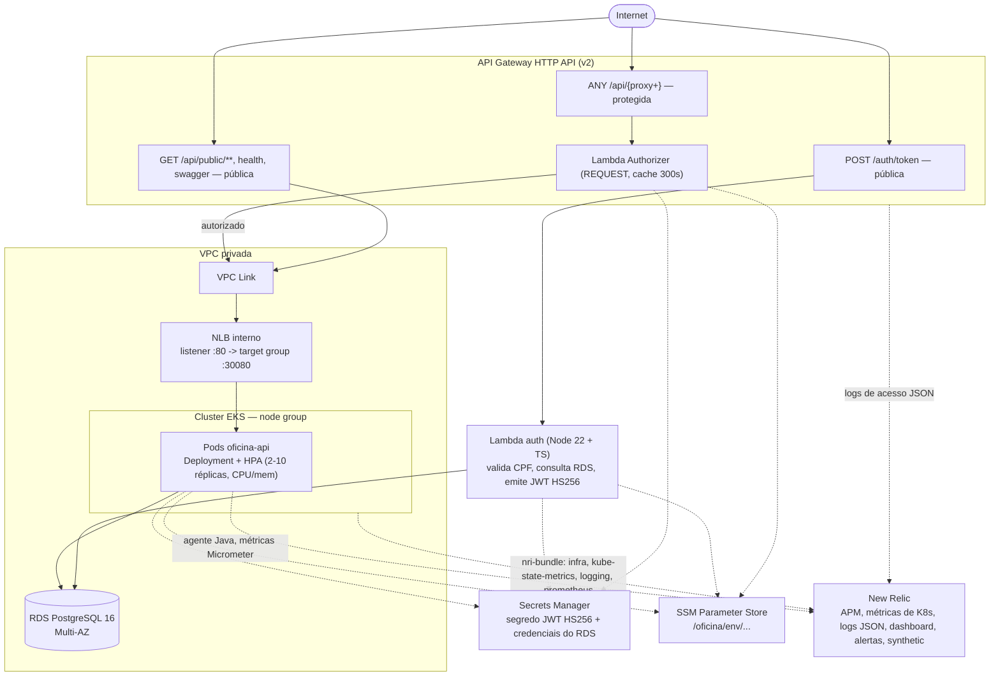

# Diagrama de componentes

Visão de nuvem do sistema — como uma requisição entra pela internet, passa pela
autenticação serverless e chega ao cluster Kubernetes e ao banco gerenciado.
Reflete o que está provisionado em Terraform nos três stacks (`infra-k8s`,
`infra-database`, `lambda-auth`) e implantado a partir do repositório da
aplicação (`oficina-api`).

Notas sobre o diagrama:

- A rota protegida (`ANY /api/{proxy+}`) e as rotas públicas do backend
  (`/api/public/**`, `/api/health`, `/api/actuator/health*`, Swagger) usam a
  **mesma integração privada** (`HTTP_PROXY` via VPC Link); a diferença é que
  só a primeira tem `authorization_type = "CUSTOM"` com o Lambda Authorizer
  anexado (`lambda-auth/terraform/apigateway.tf`).
- O tráfego para o cluster nunca sai da VPC: a integração é `VPC_LINK`, não
  uma chamada HTTP pública ao NLB.
- Não há AWS Load Balancer Controller no cluster — o NLB é criado diretamente
  em Terraform (`infra-k8s/terraform/nlb.tf`) e anexado ao Auto Scaling Group
  do node group, porque o listener do VPC Link precisa de um ARN determinado
  em tempo de `plan`, antes de qualquer manifesto Kubernetes existir.
- O HPA (`infra-k8s/k8s/base/hpa.yaml`) depende do `metrics-server`, instalado
  como *addon* Helm em `infra-k8s/terraform/addons.tf`.

## Componente → responsabilidade → repositório

| Componente | Responsabilidade | Repositório / arquivo |
|---|---|---|
| API Gateway HTTP API (rotas, stage, logs de acesso) | Porta de entrada única; roteia `/auth/token` (pública), `/api/{proxy+}` (protegida) e as rotas públicas do backend | `lambda-auth` (`terraform/apigateway.tf`) |
| Lambda Authorizer | Valida o JWT Bearer nas rotas protegidas e devolve `context` (clienteId, cpf, nome, role) que vira cabeçalho para o backend | `lambda-auth` (`src/authorizer.ts`, `terraform/lambda.tf`) |
| Lambda auth | Valida CPF, consulta o cliente no RDS, verifica `ativo` e emite o JWT HS256 | `lambda-auth` (`src/handler.ts`, `terraform/lambda.tf`) |
| Segredo JWT (Secrets Manager) | Chave HS256 compartilhada entre Lambda auth, Authorizer e a aplicação | `lambda-auth` (`terraform/secrets.tf`) |
| VPC, sub-redes públicas/privadas, NAT | Rede onde vivem o EKS, o RDS e a Lambda de autenticação | `infra-k8s` (`terraform/vpc.tf`) |
| VPC Link | Caminho privado do API Gateway até o NLB interno | `infra-k8s` (`terraform/nlb.tf`, publicado via SSM e consumido por `lambda-auth`) |
| NLB interno + target group | Encaminha para o NodePort 30080 dos nós do EKS | `infra-k8s` (`terraform/nlb.tf`) |
| Cluster EKS + node group | Executa os pods da aplicação | `infra-k8s` (`terraform/eks.tf`) |
| ECR | Registro da imagem Docker da aplicação | `infra-k8s` (`terraform/ecr.tf`) |
| Deployment/Service/HPA/PDB `oficina-api` | Topologia de execução, autoscaling por CPU/memória, disponibilidade durante rollout/drenagem | `infra-k8s` (`k8s/base/`, overlays `homolog`/`prod`) |
| Aplicação `oficina-api` (imagem, código) | Regras de negócio (Clean Architecture), autenticação local defensiva, métricas de negócio | `oficina-api` |
| RDS PostgreSQL 16 (Multi-AZ) | Persistência transacional de clientes, veículos, ordens de serviço, itens, peças e usuários | `infra-database` (`terraform/rds.tf`) |
| Credenciais do RDS (Secrets Manager) | Usuário/senha do banco, gerados pelo Terraform e nunca versionados | `infra-database` (`terraform/rds.tf`) |
| SSM Parameter Store (`/oficina/<env>/...`) | Contrato de integração entre os três stacks Terraform (ver ADR-0005) | `infra-k8s`, `infra-database`, `lambda-auth` (cada um publica os seus `ssm.tf`) |
| New Relic (`nri-bundle`, dashboard, alertas, synthetic) | Observabilidade do cluster (APM, métricas de K8s, logs) e da aplicação | `infra-k8s` (`terraform/newrelic.tf`) |
| Agente Java New Relic + métricas Micrometer | Instrumentação da aplicação (transações, `oficina.ordens.*`, `oficina.integracoes.falhas`) | `oficina-api` |
