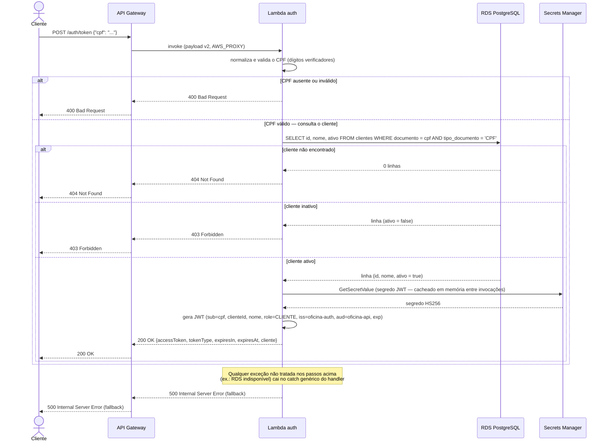
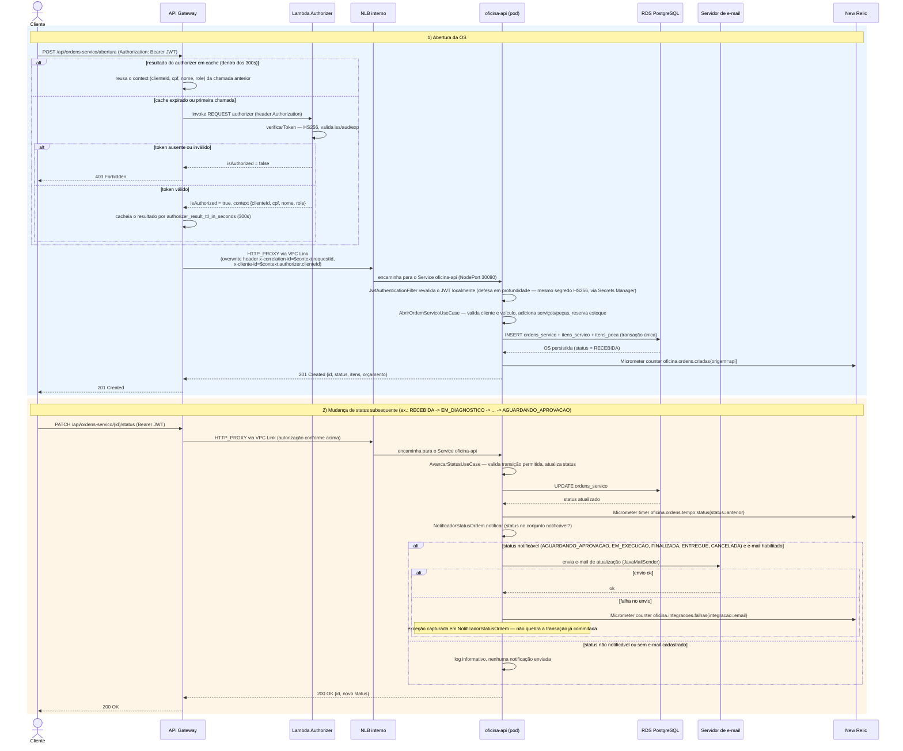

# Diagramas de sequência

## a) Autenticação por CPF

`POST /auth/token` é a única rota pública que emite credencial. A Lambda
(`lambda-auth/src/handler.ts`) valida o CPF, consulta o cliente no RDS e, se
tudo estiver certo, busca o segredo HS256 no Secrets Manager para assinar o
JWT. Os três ramos de erro (`400`, `404`, `403`) e o ramo de falha interna
(`500`) existem tal como no código.

O `x-correlation-id` devolvido em todas as respostas vem do cabeçalho
`x-correlation-id` recebido, do `requestId` do API Gateway
(`evento.requestContext.requestId`) ou do `awsRequestId` do contexto Lambda,
nessa ordem de preferência (`lambda-auth/src/handler.ts`, `extrairCorrelationId`).

## b) Abertura de ordem de serviço (com autorização e notificação de status)

Rota protegida: `POST /api/ordens-servico/abertura`, atrás do Lambda Authorizer
(`REQUEST`, TTL de cache de 300 s). A abertura em si é transacional — cliente,
veículo, serviços e peças são resolvidos e a OS nasce com status `RECEBIDA`
— e só **registra a métrica de criação**. A notificação por e-mail só ocorre
numa transição de status posterior (`AvancarStatusUseCase` /
`NotificadorStatusOrdem`), porque `RECEBIDA` não está no conjunto de status
notificáveis (`ordemservico/usecases/NotificadorStatusOrdem.java`). O
diagrama mostra as duas interações em sequência para cobrir o ciclo completo.

Notas:

- O JWT chega intacto ao pod: o API Gateway não o transforma, apenas injeta
  `x-correlation-id` e `x-cliente-id` como cabeçalhos adicionais
  (`request_parameters` em `lambda-auth/terraform/apigateway.tf`).
- A revalidação do JWT pela aplicação (`JwtAuthenticationFilter` +
  `JwtService`) é defesa em profundidade, não uma segunda autenticação
  independente: usa o mesmo segredo HS256, obtido do Secrets Manager via
  variável de ambiente do Deployment.
- Se qualquer item da abertura falhar (ex.: estoque insuficiente de uma
  peça), a exceção reverte a transação inteira — nenhuma OS parcial é
  persistida (`AbrirOrdemServicoUseCase`, `@Transactional`).
- Uma falha ao persistir (não ao notificar) incrementa
  `oficina.ordens.falhas`, consumida pela condição de alerta
  `falha_processamento_os` (`infra-k8s/terraform/newrelic.tf`).
